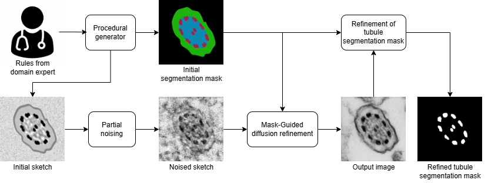
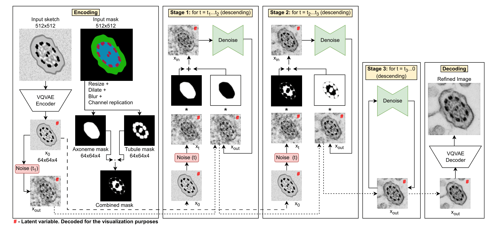
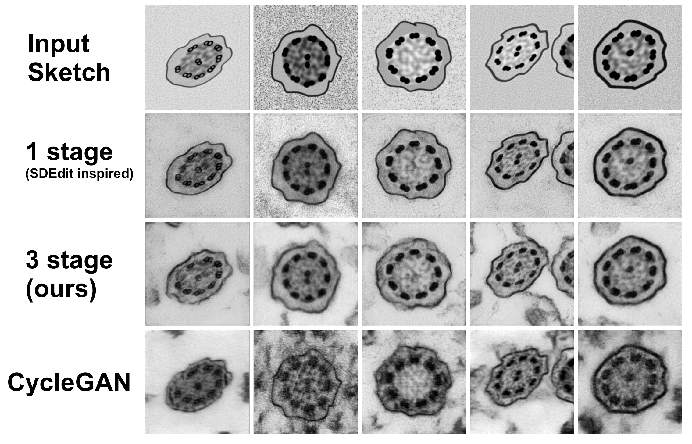

# Rule-based synthesis of microscopy images by diffusion refinement

## Overview
This repository implements a framework for synthesizing realistic medical microscopy images (specifically, motile cilia cross-sections) using procedural generation combined with mask-guided diffusion refinement.

The pipeline begins with a procedural generator that creates a coarse structural sketch along with its corresponding segmentation masks, based on parameterized expert-defined diagnostic rules. These sketches provide the correct structural layout but lack realistic visual appearance.

A latent diffusion model is then used to refine the sketch. The diffusion process is guided by the segmentation masks to ensure that structural regions, such as tubules and the axoneme, are preserved while non-structural regions are freely enhanced to increase realism.

After the image refinement, the tubule segmentation mask is also updated to reflect any subtle shape changes introduced during refinement, ensuring consistency between the synthesized image and its annotation.

**Key Features**
- Procedural generator conditioned on expert diagnostic rules
- Multi-stage diffusion refinement guided by segmentation masks
- Structural preservation with enhanced visual realism
- Flexible pipeline suitable for microscopy image synthesis

## Getting started

### Diffusion model

Download the weights of the [pretrained Diffusion models for unconditional Cilium synthesis](https://drive.google.com/drive/folders/1dWycMm9v3RfhgWFcAzvXXaVkw-1_cj3s?usp=sharing) and place them in [./src/diffusion_refinement/models/](./src/diffusion_refinement/models/)

### Procedural generator

Example usage of the procedural generator with input parameters is provided in [procedural_cilium.ipynb](./src/procedural_generator/procedural_cilium.ipynb)

### Mask-guided diffusion refinement

The implemented mask-guided diffusion refinement is focused on the refinement of the generated sketches by our procedural generator. Example usage is provided in [refine_sketch.ipynb](./src/diffusion_refinement/refine_sketch.ipynb)

### Tubule segmentation mask refinement

Example usage of the refinement for the tubule segmentation mask is provided in [refine_tubule_mask.ipynb](./src/refine_tubule_mask.ipynb)

## Result comparison

**Comparison of different approaches for input sketches.** 

For the **1 Stage** diffusion refinement, the $t_{start}$ was set to $250$, as structural changes appeared for higher values. This approach is inspired by SDEdit, since the DDPM model was used for refinement rather than SDE.

The **3 stage** mask-guided diffusion refinement approach used $t_1 = 650$, $t_2 = 350$, and $t_3 = 250$
